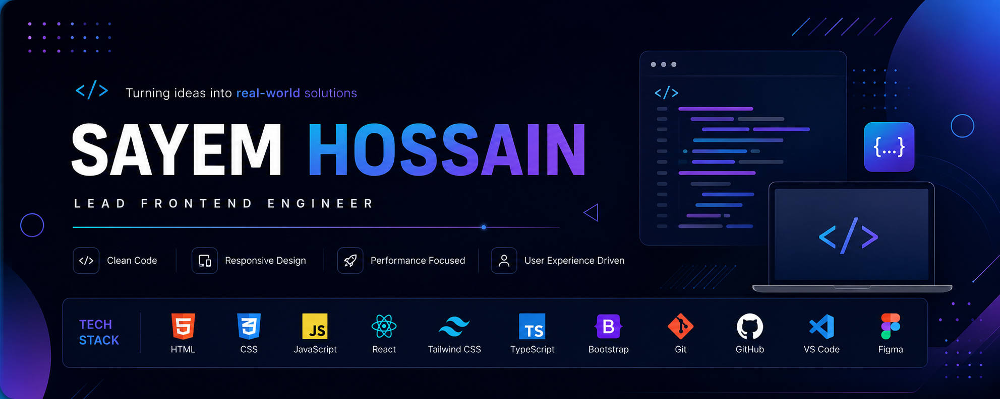

<!-- ======================= BANNER ======================= -->


<div align="center">


</div>


<br>

<!-- ======================= INTRO ======================= -->

<div align="center">

# Sayem Hossain

### Frontend Developer • UI Enthusiast • Creative Thinker

<p>
  Building clean, responsive and user-focused web experiences.
</p>

</div>

---

<!-- ======================= ABOUT ME ======================= -->

## About Me

I'm **Sayem Hossain**, a passionate **Frontend Developer** focused on building modern, responsive, and interactive web experiences.

I enjoy transforming ideas and designs into functional interfaces with clean code, thoughtful UI, and a strong focus on user experience.

- Currently learning **React.js & TypeScript**
- Passionate about **Frontend Development**
- Interested in **UI/UX and modern web design**
- Enjoy building **real-world projects**
- Continuously improving my **JavaScript and problem-solving skills**
- Exploring modern frontend tools and technologies
- Working toward becoming a **professional Full-Stack Developer**

---

<!-- ======================= TECHNOLOGY STACK ======================= -->

# Technology Stack

### Frontend

<p>
  
</p>

`HTML` • `CSS` • `JavaScript` • `React.js` • `TypeScript`  
`Tailwind CSS` • `Bootstrap`

---

### UI Libraries

<p>
  
</p>

`Ant Design` • `React Icons` • `Lucide Icons`

---

### Design & Creative Tools

<p>
  
</p>

`Figma` • `Adobe Photoshop` • `Adobe Lightroom`  
`UI Design` • `Responsive Design` • `Visual Design`

---

### Development Tools

<p>
  
</p>

`Git` • `GitHub` • `VS Code` • `Vite` • `npm`

---

<!-- ======================= GITHUB ACTIVITY ======================= -->

# GitHub Activity

<div align="center">


</div>

<br>

<div align="center">


</div>

---

<!-- ======================= CONTRIBUTION GRAPH ======================= -->

# Contribution Activity

<div align="center">


</div>

---

<!-- ======================= PROJECTS ======================= -->

# Featured Projects

<div align="center">

<a href="https://github.com/sayem414hossain">
  
</a>

</div>

> Replace `YOUR_REPOSITORY_NAME` with one of your actual project repositories.

---

<!-- ======================= CURRENTLY LEARNING ======================= -->

# Currently Learning

```text
React.js
   ↓
TypeScript
   ↓
Advanced JavaScript
   ↓
Modern Frontend Architecture
   ↓
Full-Stack Development
